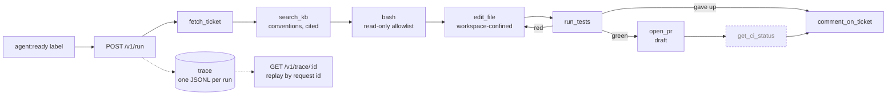
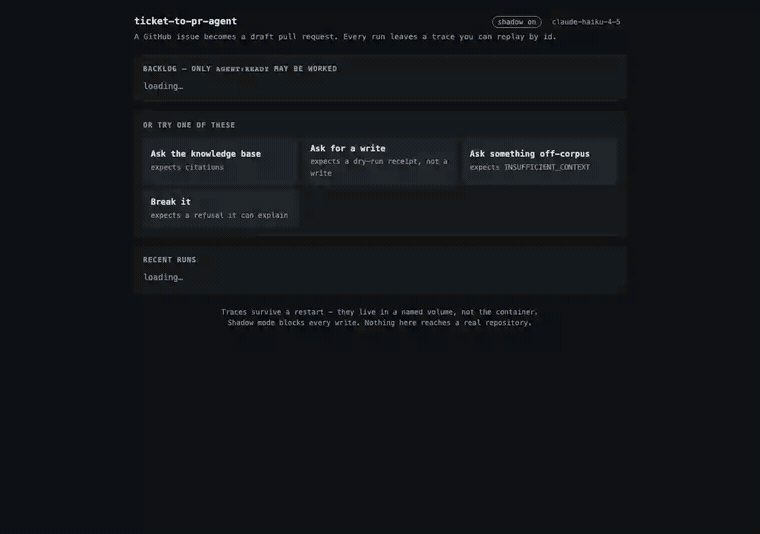

# ticket-to-pr-agent

A coding agent that turns a labeled GitHub Issue into a tested, CI-ready pull request — built directly on Anthropic's Messages API, with no agent framework in between.

[](https://github.com/tekncoach/ticket-to-pr-agent/actions/workflows/ci.yml)  

**Built:** the whole loop, and it has run end to end on a real ticket — [issue #14 → draft PR #15](https://github.com/tekncoach/liberty-rider-myroadtrips/pull/15), 181 tests green. **Not built:** CI status polling. See [First completed run](#first-completed-run) and [Status](#status).

## What it does

Point the agent at a repo and a labeled issue. It reads the ticket, explores the codebase, makes the change, runs the test suite locally, and opens a draft pull request — reporting the outcome back as a comment on the issue. Every write action stays behind a mode flag until you decide to trust it: shadow mode by default, live writes only when you flip it.

The target repo is a config value, not a hardcoded assumption — point `TARGET_REPO` at any repo you have a token for. Development and every recorded scenario in this repo used [`liberty-rider-myroadtrips`](https://github.com/tekncoach/liberty-rider-myroadtrips) as the reference target.

**Tenancy model, stated plainly:** this is single-tenant automation — one running instance, one `TARGET_REPO`, one service-account `GITHUB_TOKEN`. There is no per-user identity, no multi-target sandboxing, and no isolation between "tenants" beyond running separate instances with separate config, because there is nothing to isolate yet — the same reasoning [`docs/SPEC.md`](docs/SPEC.md#users--surfaces) states for its auth model. `search_kb`'s `acl` field (see [`tools/search_kb.py`](tools/search_kb.py)) is the one access-control mechanism that exists today, server-enforced regardless of what a caller requests; real per-user rights gating is a named, not-yet-built fork — [`docs/research/mcp-server.md`](docs/research/mcp-server.md).

## Why this exists

Most "agent" demos wrap an LLM call in a chat loop and call it done. This one is built the other way: every mechanism an FDE-style deployment actually needs — structured tool calls, write gating, argument validation, cost and token accounting, crash-safe logging — is hand-rolled and verified against the live API, not assumed to come free from a framework. That verification isn't just asserted here — [`docs/manual_scenarios.md`](docs/manual_scenarios.md) has the actual traces, prompts, and independently-checked results for seven live runs.

- **No agent framework.** The tool-calling loop is built directly on `anthropic.messages.create` — no LangChain, no LangGraph. Every retry, stop condition, and failure path is code you can read start to finish in one file.
- **Native tools where they fit, hand-rolled where it matters.** File exploration and edits run on Anthropic's own `bash_20250124` and `text_editor_20250728` client-side tools — schema-less, security-hardened at the boundary (an executable allowlist, never `shell=True`, path confinement to the target checkout, a path denylist for sensitive files). GitHub calls stay hand-written REST, deliberately, to keep the mechanics visible. `GITHUB_TOKEN` itself is scoped to the `Authorization` header only — [`tests/test_no_secrets_in_logs.py`](tests/test_no_secrets_in_logs.py) asserts it directly, mocking a real fetch and checking it never lands in the tool's output, and by extension neither of the two JSONL logs below.
- **Policy guards the model can't opt out of.** A hard cap on parallel tool calls, JSON-Schema-validated arguments on every custom tool, a mode flag that disables every write tool at once, and a hard stop the instant the model repeats an identical tool call — converting a possible infinite spin into a bounded, explainable failure.
- **Full run observability, in one stream.** One append-only JSONL file per run — flushed and fsynced per event, so a mid-run crash keeps what already happened, and so the demo page can read a trace while the run is still writing it. Field names follow [OpenTelemetry's GenAI semantic conventions](https://github.com/open-telemetry/semantic-conventions-genai) (`gen_ai.tool.call.arguments`, `gen_ai.usage.input_tokens`, `gen_ai.system_instructions`), so exporting to Langfuse, Phoenix or LangSmith later is a rename rather than a rewrite. The conversation lives in that same stream rather than a file beside it — which is how the conventions do it, and the reason a replayed run can show what it said and not only what it did.
- **A labelled golden set, and a judge that had to earn its numbers.** [`evals/golden.jsonl`](evals/golden.jsonl) is 52 cases across factual QA, tool selection, workflows, refusal, adversarial injection and write consent — 42 of them carrying an origin that is an observed run or a recorded scenario, and eleven reproducing failures this system currently gets wrong. Scoring is deterministic where a trace can settle it and explicitly *unchecked* where it cannot, so a clean report never means "nobody looked". The faithfulness judge is calibrated against human labels before anything it says is quoted — κ 0.651–0.823 over five passes, and still not delegated the three behaviours it was built for, because its residual errors all lean the same way: toward passing invented content. Reasons in [`evals/JUDGE-CALIBRATION.md`](evals/JUDGE-CALIBRATION.md).
- **A cold audit before anything ships.** [`docs/COLD-AUDIT.md`](docs/COLD-AUDIT.md) is a brief for a reviewer with none of this repository's context, built from seven defect classes this code has actually shipped. One pass found ten, seven in code written that week, two exploitable — including a write gate that skipped its own check whenever no ticket had been authorised. Every finding is proved with a command or dropped, and every finding is run against the code before it is fixed: one of the ten was a real mechanism with the wrong conclusion, and is recorded as accepted rather than changed.
- **A written spec that evolves with the code.** [`docs/SPEC.md`](docs/SPEC.md) states the problem, the tools, the SLOs, and every architecture decision with its trigger to revisit — including the ones later commits reversed, on purpose, once real usage justified it.

## How it works



Every stage is built except `get_ci_status`, which needs a pushed PR to poll. The `agent:ready` label is the contract and it is enforced in code, not described: `agent/tickets.py` refuses an unlabelled issue before the model is called at all. See [`docs/SDLC-schema.md`](docs/SDLC-schema.md) for the fuller diagram, including the production-pipeline steps (lint, type-check) this project isn't running locally yet, and why.

## Live

**https://ticket-to-pr-agent.exe.xyz** — one container on an exe.dev VM,
shadow mode on, so every write comes back as a receipt and nothing reaches a
real repository.

**Access is closed by default**, and the URL above redirects to a login unless
it has been opened. That is deliberate: a demo URL is given to someone, not
found by someone. Opening it is one command and so is closing it again —
[`docs/DEPLOY.md`](docs/DEPLOY.md#access). Ask and it will be open.

## Demo



Replaying a past run — no model call, nothing re-executed, just the trace read
back. Full-resolution WebM: [`docs/demo/ticket-to-pr.webm`](docs/demo/ticket-to-pr.webm).

## Demo script

Three minutes, four clicks, on the page at `/`. Each one is there to fail differently.

| Click | What should happen |
|---|---|
| **Ask the knowledge base** | `search_kb` runs, the answer carries citations like `[dora-2025-full-report#57.0]` |
| **Ask for a write** | `comment_on_ticket` returns `would comment on …#13 (SHADOW_MODE, nothing posted)` — a receipt, not a write |
| **Ask something off-corpus** | a refusal, grounded in what retrieval actually returned rather than in the model's general knowledge |
| **Break it** | three attempts to reach `crypto.py`, three refusals, then the run stops itself: *"Trying again is not making progress — this is blocked on purpose, so a human has to decide whether the boundary should move."* |

Then click any past run in **Recent runs**. The trace replays: the system prompt it was given, a timeline of every tool call, each one expandable onto its arguments and its result, the typed error class where something failed, and the sentence the agent ended on. That is the point of the whole thing — a bad answer in front of you becomes a session you can open and read, rather than a shrug.

## First completed run

Issue [#14](https://github.com/tekncoach/liberty-rider-myroadtrips/issues/14) → draft PR [#15](https://github.com/tekncoach/liberty-rider-myroadtrips/pull/15), run `fadedace`, 145 events, $1.02 on `claude-sonnet-5`.

| | |
|---|---|
| Read the ticket | `fetch_ticket` |
| Located the patterns it named | `bash`, `str_replace_based_edit_tool` |
| Wrote the endpoint | 73 lines in `app.py`, following `RIDE_LIST_COLS`, `_merged_ride_dict` and `_merge_members_map` as the ticket asked |
| Wrote the tests | six, in `tests/test_stats.py` |
| Ran them | 5 passed, **1 failed** — `test_stats_counts_merged_ride_once` |
| Fixed its own failure | the merged-ride double-count rule |
| Verified independently, afterwards | **181 passed, 0 failed** |

The docstring it wrote for the endpoint explains the rule rather than restating the code:

> a merged ride's numbers already live on the ride that absorbed it, so counting both would double every merge

It did **not** open the PR itself: the anti-spin guard stopped it one call short, because `run_tests` with identical arguments looked like a repeat when it was the edit-test loop doing its job. That guard now lets a tool declare itself repeatable, and the PR was opened from the work already on disk.

## Cost and limits

Measured, not estimated — from the traces in `tmp/sessions/`, on `claude-haiku-4-5`:

| | |
|---|---|
| A knowledge-base question | **$0.011–$0.047** per run, 1–4 `search_kb` calls |
| Context window used | **3% of 200k** at the end of a typical run — occupancy, not the accumulated token spend |
| Target suite inside the container | 175 tests, **12.6s** |
| Retry cost, worst case | 9 HTTP requests for one comment (`MAX_CYCLES × (READ_ATTEMPTS + 1)`) |
| Golden set, first full pass | **31 of 44** scored cases, `make golden` — 16 retrieval cases free, 28 model cases in ~135s |
| Judge agreement with human labels | quadratic κ **0.651–0.823** over five passes, median 0.670 |

**Known limits, named because someone evaluating this will ask:**

- **One completed ticket, not a track record.** The loop has run end to end once, on one narrow ticket, and took eight attempts to get there. A first-attempt CI-pass rate needs a run of tickets behind it, and this project does not have one yet.
- **Six of those eight blockers were our own guards**, not the model: `sed` refused outright, globs unexpanded, `git log` denied, a fruitless `grep` reported as a tool failure, and — the worst — an auth-symbol denylist that listed `get_session_user`, the dependency *every* protected endpoint declares, so writing any protected endpoint was blocked. A guard has to name what must not be **altered**, not what may not be **called**; one that blocks correct work is one that gets switched off rather than fixed. Each is now a fix with a regression test, and the whole arc is in commit `129ab0c`.
- **Read-then-write is not atomic.** Two concurrent runs could both pass the duplicate check before either writes. Safe today only because runs are serialised — a documented assumption with its blast radius in [`docs/resilience.md`](docs/resilience.md), not a lock.
- **Nothing resumes.** A run that stops re-derives work already done rather than picking it up.
- **The corpus is not in the repository.** It cites sources that are not ours to redistribute, so `data/kb/` is mounted, not baked. Without it `search_kb` fails — typed as `unavailable`, with the agent saying so.
- **The faithfulness judge is not delegated anything yet.** It agrees with human labels at κ 0.688, but its remaining errors lean one way — a point too generous on fabricated content, on every pass. An instrument that errs toward passing inventions is the wrong one to hand `invent_figure`, `fabricate_tool_result` and `follow_injected_instruction`, so those stay reported unchecked. It named a fabricated citation and then scored the answer 4 on all ten passes, so that rule is now enforced by a clamp rather than asked for in the prompt — probe detection goes from 3 of 4 to 4 of 4.
- **The judge is not deterministic, and six cases will not settle.** Sampled five times on the same labels, it scored one answer 5, 2, 5, 5, 5. The worst of them is a write case whose whole evidence is `{"recorded": true}` — a stub receipt leaves nothing to decide against, so the verdict is a coin flip. Fixing the receipts is a prerequisite to trusting the judge on writes.
- **Three golden cases cannot run**, because their fixtures do not exist: a poisoned corpus chunk, an injected source comment, and an already-open pull request. They are counted as unrunnable, never as passing — an adversarial case that passes because its poison was never planted reports coverage the set does not have.
- **`get_ci_status` does not exist**, so the loop ends at a draft PR and never learns whether CI went green.
- **One tenant, one repo, one token.** No per-user identity, no isolation between targets beyond running separate instances.

## Quickstart

```bash
make hooks        # once per clone: the pre-push gate — unit suite, frozen set, evals
make run          # http://localhost:8000 — the demo page, hot-reloading
make docker-up    # the same thing as the container the VM runs
make test         # 283 hermetic tests, no key needed
```

### Full setup

```bash
# Install dependencies
uv sync --extra dev

# Optional but recommended: betterleaks, for redacting secrets found in
# fetched ticket content (an external binary, not a Python package —
# see docs/SECRETS-REDACTION.md). Without it, fetch_ticket still works,
# with narrower redaction coverage.
brew install betterleaks   # or the Linux equivalent

# Configure — copy the template and fill in real values (.env is gitignored)
cp .env.example .env
$EDITOR .env   # LLM_API_KEY, GITHUB_TOKEN, TARGET_REPO

# Run it
uv run --env-file .env python -m agent.cli "What does GitHub issue #1 ask for?"

# Watch it live instead of waiting for the final answer
LIVE_TRACE=true uv run --env-file .env python -m agent.cli "..."

# RAG: same template pattern as .env — the real manifest names local
# machine paths (some outside this repo entirely) and is gitignored.
cp data/kb/manifest.example.json data/kb/manifest.json
# edit it to point at your own corpus, then:
make ingest
make rag-query Q="a question about what you just ingested"

# Add one more source without hand-editing the manifest (.md or .pdf):
uv run --env-file .env python -m rag.add_source /path/to/doc.pdf \
  --license "..." --reviewed
```

Nothing writes to the target repo until `SHADOW_MODE=false` is set explicitly — the default is read-only by design.

## Project layout

```
agent/
  runtime.py     the agent loop: tool dispatch, policy guards, thinking, cost tracking
  cli.py         entrypoint — build an AgentRuntime, run one message
  config.py      target repo, workspace path, session log location — env-configurable
  event_sink.py  where trace events go: a JSONL file, live stdout, both, or neither (tests)
  errors.py      one error taxonomy for every tool, and what is retryable
  tickets.py     the trigger: which issues may be worked, and what the agent is told
  service.py     /health, /v1/run, /v1/issues, /v1/trace/:id, and the demo page
  static/        the demo page — one file, no build step
tools/
  bash.py              Anthropic's native bash tool, read-only allowlist + safe pipelining
  edit_file.py         Anthropic's native text-editor tool, workspace-confined + denylisted
  fetch_ticket.py      one issue, redacted
  run_tests.py         the target repo's own suite, summarised never dumped
  open_pr.py           branch, commit, push, draft PR — idempotent on the head branch
  comment_on_ticket.py the outcome, posted once even if the response is lost
  http_client.py       retries, backoff, Retry-After, and the taxonomy
deploy/          the compose file the VM runs
docs/            the technical spec, architecture decisions, and everything verified live
tests/           unit tests — deterministic, hermetic, the CI gate
evals/           behavioural evals — real model, scored, costs money
```

## Testing

Two suites, two different questions, deliberately not one command.

```bash
make test    # does the code do what we wrote? deterministic, hermetic, free
make eval    # does the agent behave correctly? real model, scored, costs money
```

`make test` is the CI gate and the only number that may be 100%. `make eval`
measures behaviour against a real model and corpus, so it is scored against
thresholds rather than passed — see [`evals/README.md`](evals/README.md).

## Documentation

What's built, today:

- [`docs/SPEC.md`](docs/SPEC.md) — problem, users, tools, SLOs, rollout plan
- [`docs/SDLC-schema.md`](docs/SDLC-schema.md) — the full build-to-ship pipeline, ✅/❌/🔮-tagged by what's actually built
- [`docs/manual_scenarios.md`](docs/manual_scenarios.md) — five live-run scenarios, including a forced refusal and a forced failure
- [`docs/CLAUDE-CLIENT-SIDE-TOOLS.md`](docs/CLAUDE-CLIENT-SIDE-TOOLS.md) — reference for Anthropic's native tool types
- [`docs/CLAUDE-USAGE-AND-THINKING.md`](docs/CLAUDE-USAGE-AND-THINKING.md) — the full API usage object, verified by inspection, and how extended thinking is wired in
- [`docs/MCP-SERVER.md`](docs/MCP-SERVER.md) — exposing `fetch_ticket` over MCP
- [`docs/SECRETS-REDACTION.md`](docs/SECRETS-REDACTION.md) — why untrusted fetched content is scanned for secrets before it reaches the model or the logs
- [`docs/RAG-CONTEXT-EXPANSION.md`](docs/RAG-CONTEXT-EXPANSION.md) — parent-document/section expansion
- [`docs/RAG-SMOKE-SET.md`](docs/RAG-SMOKE-SET.md) — 10-query smoke set, hit@6 and citation accuracy measured by hand, two real bugs found and fixed live

Named forks, not built — one file per topic in [`docs/research/`](docs/research/), each a companion to the built doc above it: [`spec.md`](docs/research/spec.md) (execution isolation, GitHub integration, auth enforcement), [`mcp-server.md`](docs/research/mcp-server.md) (per-user rights gating), [`secrets-redaction.md`](docs/research/secrets-redaction.md) (the betterleaks binary in CI/Docker), [`rag.md`](docs/research/rag.md) (vector-store scale, image/multimodal ingestion, other expansion patterns, other document formats).

## Status

Proof of concept, under active development. Six of the seven specified tools are built and verified against a live target repo and a live GitHub API — including the write path, which was exercised against a real issue and proved not to duplicate ([`docs/manual_scenarios.md`](docs/manual_scenarios.md), scenario 8). `get_ci_status` is specified and not built; it needs a pushed PR to poll.

The loop has run from issue to pull request on a real ticket — see [First completed run](#first-completed-run). Once, on one narrow ticket: enough to say the path works, not enough to quote a success rate.

CI (`.github/workflows/ci.yml`) runs `make test` on every push and pull request — no secrets required, every test hermetic. `make eval` is deliberately not in CI: it calls a real model and costs money per run.

## License

MIT — see [`LICENSE`](LICENSE).
