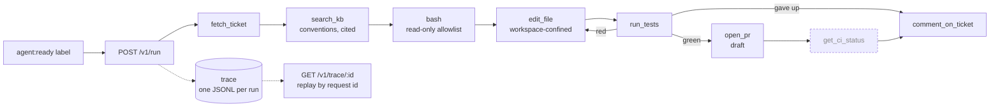
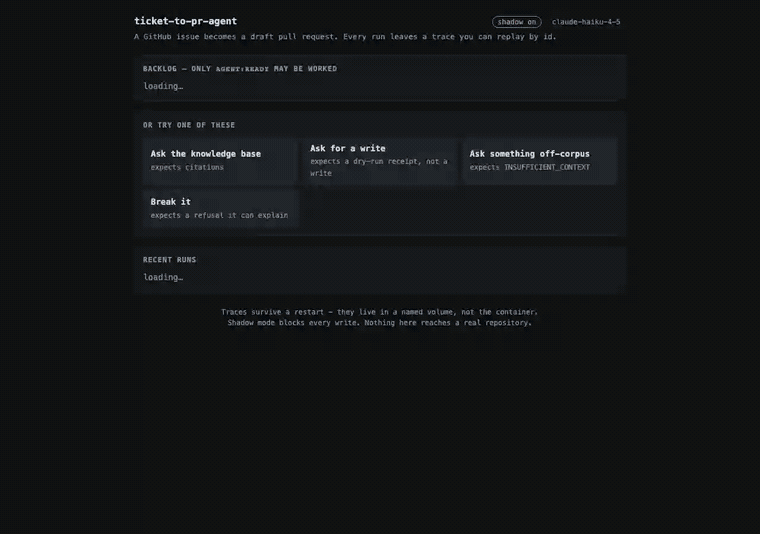

# ticket-to-pr-agent

A coding agent that turns a labeled GitHub issue into a tested, CI-ready pull request. Built directly on Anthropic's Messages API, with no agent framework.

[](https://github.com/tekncoach/ticket-to-pr-agent/actions/workflows/ci.yml)  

**Status:** proof of concept. The loop has run end to end once, on one ticket ([issue #14 → draft PR #15](https://github.com/tekncoach/liberty-rider-myroadtrips/pull/15)). `get_ci_status` is specified and not built, so the loop stops at a draft PR. See [`docs/COST-AND-LIMITS.md`](docs/COST-AND-LIMITS.md).

## What it does

Point it at a repo and a labeled issue. It reads the ticket, explores the codebase, makes the change, runs the test suite, and opens a draft pull request, then reports the outcome as a comment on the issue.

Every write action is behind a mode flag. `SHADOW_MODE` is on by default: writes come back as receipts and nothing reaches the repository. The target is a config value (`TARGET_REPO`), and every recorded run here used [`liberty-rider-myroadtrips`](https://github.com/tekncoach/liberty-rider-myroadtrips). It is single-tenant: one instance, one repo, one token.

## How it works


```mermaid
flowchart LR
    L["agent:ready label"] --> R["POST /v1/run"]
    R --> F["fetch_ticket"]
    F --> K["search_kb<br/>conventions, cited"]
    K --> B["bash<br/>read-only allowlist"]
    B --> E["edit_file<br/>workspace-confined"]
    E --> T["run_tests"]
    T -- "red" --> E
    T -- "green" --> P["open_pr<br/>draft"]
    T -- "gave up" --> C["comment_on_ticket"]
    P --> CI["get_ci_status"]:::unbuilt
    CI --> C

    R -.-> TR[("trace<br/>one JSONL per run")]
    TR -.-> V["GET /v1/trace/:id<br/>replay by request id"]

    classDef unbuilt stroke-dasharray: 4 3,color:#888;
```

The `agent:ready` label is the contract: `agent/tickets.py` refuses an unlabelled issue before the model is called. Design decisions are in [`docs/DESIGN.md`](docs/DESIGN.md); the fuller pipeline diagram is in [`docs/SDLC-schema.md`](docs/SDLC-schema.md).

## Live

https://ticket-to-pr-agent.exe.xyz runs one container on an exe.dev VM, shadow mode on. Access is closed by default and redirects to a login; opening and closing it is one command each ([`docs/DEPLOY.md`](docs/DEPLOY.md#access)).



Walkthrough: [`docs/DEMO.md`](docs/DEMO.md).

## Quickstart

```bash
make hooks        # once per clone: the pre-push gate (unit suite, frozen golden set)
make run          # http://localhost:8000, hot-reloading
make docker-up    # the container the VM runs
make test         # hermetic tests, no key needed
```

Setup:

```bash
uv sync --extra dev
brew install betterleaks      # optional: redacts secrets in fetched tickets, see docs/SECRETS-REDACTION.md

cp .env.example .env          # then set LLM_API_KEY, GITHUB_TOKEN, TARGET_REPO
uv run --env-file .env python -m agent.cli "What does GitHub issue #1 ask for?"
LIVE_TRACE=true uv run --env-file .env python -m agent.cli "..."   # stream the trace

# RAG corpus
cp data/kb/manifest.example.json data/kb/manifest.json            # point it at your own corpus
make ingest
make rag-query Q="a question about what you just ingested"
uv run --env-file .env python -m rag.add_source /path/to/doc.pdf --license "..." --reviewed
```

Nothing writes to the target repo until `SHADOW_MODE=false` is set explicitly.

## Project layout

```
agent/    runtime (loop, guards, cost tracking), CLI, config, error taxonomy, trigger, HTTP service, demo page
tools/    bash, edit_file, fetch_ticket, run_tests, open_pr, comment_on_ticket, http client
rag/      ingestion, embeddings, retrieval
evals/    golden set, scorers, judge, gates (real model, scored, costs money)
shadow/   shadow-mode runner and analysis, see shadow/README.md
tests/    unit tests: deterministic, hermetic, the CI gate
docs/     spec, design, deploy, runbooks, verified scenarios
deploy/   the compose file the VM runs
```

## Testing

```bash
make test    # does the code do what we wrote? deterministic, hermetic, free; the CI gate
make eval    # does the agent behave correctly? real model, scored against thresholds, costs money
```

See [`evals/README.md`](evals/README.md). CI runs `make test` on every push and pull request; `make eval` is not in CI because it calls a real model.

## Documentation

- [`SPEC.md`](docs/SPEC.md): problem, users, tools, SLOs, rollout plan
- [`DESIGN.md`](docs/DESIGN.md): design decisions and tenancy
- [`COST-AND-LIMITS.md`](docs/COST-AND-LIMITS.md): measured costs and known limits
- [`FIRST-COMPLETED-RUN.md`](docs/FIRST-COMPLETED-RUN.md): the one end-to-end run
- [`DEMO.md`](docs/DEMO.md): the four-click walkthrough
- [`DEPLOY.md`](docs/DEPLOY.md): the VM, access, rollback
- [`SDLC-schema.md`](docs/SDLC-schema.md): build-to-ship pipeline, tagged by what is built
- [`manual_scenarios.md`](docs/manual_scenarios.md): live-run scenarios, including a forced refusal and a forced failure
- [`COLD-AUDIT.md`](docs/COLD-AUDIT.md): the context-free review brief
- [`resilience.md`](docs/resilience.md), [`SECRETS-REDACTION.md`](docs/SECRETS-REDACTION.md), [`MCP-SERVER.md`](docs/MCP-SERVER.md), [`GITHUB-TOKEN-PERMISSIONS.md`](docs/GITHUB-TOKEN-PERMISSIONS.md)
- RAG: [`RAG-CONTEXT-EXPANSION.md`](docs/RAG-CONTEXT-EXPANSION.md), [`RAG-SMOKE-SET.md`](docs/RAG-SMOKE-SET.md)
- Anthropic API notes: [`CLAUDE-CLIENT-SIDE-TOOLS.md`](docs/CLAUDE-CLIENT-SIDE-TOOLS.md), [`CLAUDE-USAGE-AND-THINKING.md`](docs/CLAUDE-USAGE-AND-THINKING.md)
- Named forks, not built: [`docs/research/`](docs/research/)

## License

MIT, see [`LICENSE`](LICENSE).
